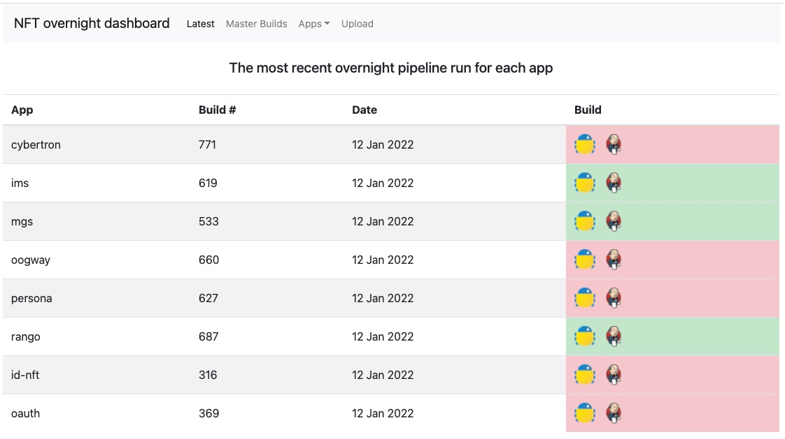
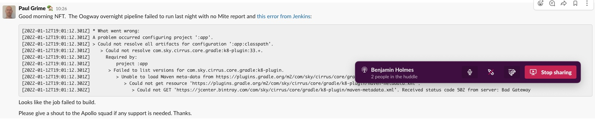

# Overnight Pipelines

Look at https://identity-nft-dashboard-external.dev.ce.us-west-2-aws.npskooniedc.com/ui/index.html#!/latest for pipelines.



These jobs promote whatever is in `core-int` to `stable-int` and/or `stubbed-nft`.

Slack channel to report problems to:

- giam-nft-support




Smaple from `oogway	build 660	on 12 Jan 2022`:

Mite output: `Error: Error: No data returned from backend`

Jenkins output:

```
NFT overnight dashboard
Latest
Master Builds
Apps
Upload
Jenkins output for oogway build number 660
[2022-01-12T19:00:00.613Z] Started by timer
[2022-01-12T19:00:00.614Z] Resume disabled by user, switching to high-performance, low-durability mode.
[2022-01-12T19:00:00.927Z] [Pipeline] Start of Pipeline
[2022-01-12T19:00:00.933Z] [Pipeline] lock
[2022-01-12T19:00:00.933Z] Trying to acquire lock on [identity-id-oogway-oogway-Nbcu-extended-test]
[2022-01-12T19:00:00.935Z] Resource [identity-id-oogway-oogway-Nbcu-extended-test] did not exist. Created.
[2022-01-12T19:00:00.935Z] Lock acquired on [identity-id-oogway-oogway-Nbcu-extended-test]
[2022-01-12T19:00:00.937Z] [Pipeline] {
[2022-01-12T19:00:00.938Z] [Pipeline] ansiColor
[2022-01-12T19:00:00.938Z] [Pipeline] {
[2022-01-12T19:00:00.938Z] 
[2022-01-12T19:00:00.940Z] [Pipeline] node
[2022-01-12T19:00:06.446Z] Agent identity-alpine-tiny-slave-6blcl is provisioned from template Identity-Alpine-Tiny-Slave
[2022-01-12T19:00:06.452Z] Running on identity-alpine-tiny-slave-6blcl in /home/jenkins/home/workspace/identity/id-oogway/oogway/Nbcu/oogway-extended-test
[2022-01-12T19:00:06.453Z] [Pipeline] {
[2022-01-12T19:00:06.455Z] [Pipeline] deleteDir
[2022-01-12T19:00:06.767Z] [Pipeline] dir
[2022-01-12T19:00:06.768Z] Running in /home/jenkins/home/workspace/identity/id-oogway/oogway/Nbcu/oogway-extended-test/id-oogway
[2022-01-12T19:00:06.769Z] [Pipeline] {
[2022-01-12T19:00:06.771Z] [Pipeline] checkout
[2022-01-12T19:00:06.777Z] The recommended git tool is: NONE
[2022-01-12T19:00:08.118Z] using credential 89e39217-a98f-431a-adae-372ae0d9f2f8
[2022-01-12T19:00:08.124Z] Cloning the remote Git repository
[2022-01-12T19:00:08.136Z] Cloning repository git@github.com:sky-uk/id-oogway.git
[2022-01-12T19:00:08.594Z]  > git init /home/jenkins/home/workspace/identity/id-oogway/oogway/Nbcu/oogway-extended-test/id-oogway # timeout=10
[2022-01-12T19:00:08.636Z] Fetching upstream changes from git@github.com:sky-uk/id-oogway.git
[2022-01-12T19:00:08.636Z]  > git --version # timeout=10
[2022-01-12T19:00:08.642Z]  > git --version # 'git version 2.26.3'
[2022-01-12T19:00:08.642Z] using GIT_SSH to set credentials access to repos at github.com and git.bskyb.com
[2022-01-12T19:00:08.659Z]  > git fetch --tags --force --progress -- git@github.com:sky-uk/id-oogway.git +refs/heads/*:refs/remotes/origin/* # timeout=10
[2022-01-12T19:00:11.398Z] Avoid second fetch
[2022-01-12T19:00:11.407Z] Checking out Revision abe83ea223af5322acb26de7cb82025ade158091 (origin/master)
[2022-01-12T19:00:11.390Z]  > git config remote.origin.url git@github.com:sky-uk/id-oogway.git # timeout=10
[2022-01-12T19:00:11.393Z]  > git config --add remote.origin.fetch +refs/heads/*:refs/remotes/origin/* # timeout=10
[2022-01-12T19:00:11.400Z]  > git rev-parse origin/master^{commit} # timeout=10
[2022-01-12T19:00:11.414Z]  > git config core.sparsecheckout # timeout=10
[2022-01-12T19:00:11.418Z]  > git checkout -f abe83ea223af5322acb26de7cb82025ade158091 # timeout=10
[2022-01-12T19:00:14.948Z] Commit message: "IPB-15907 updates stubbed-functional jobs to use oogway-secrets (#725)"
[2022-01-12T19:00:14.951Z]  > git rev-list --no-walk f83eb75945af058613f4df26d174d08f7f2059e7 # timeout=10
[2022-01-12T19:00:14.975Z] [Pipeline] sh
[2022-01-12T19:00:15.305Z] + git show-ref -q refs/remotes/origin/master
[2022-01-12T19:00:15.361Z] [Pipeline] echo
[2022-01-12T19:00:15.361Z] Building against 'master', which is a branch.  Resolving to a commit hash...
[2022-01-12T19:00:15.363Z] [Pipeline] sh
[2022-01-12T19:00:15.641Z] + git show-ref --hash refs/remotes/origin/master
[2022-01-12T19:00:15.655Z] [Pipeline] sh
[2022-01-12T19:00:15.931Z] + git branch -r '--format=%(refname:short)' --contains abe83ea223af5322acb26de7cb82025ade158091
[2022-01-12T19:00:15.932Z] + tr '
[2022-01-12T19:00:15.932Z] ' ,
[2022-01-12T19:00:15.932Z] + sed 's/, $//'
[2022-01-12T19:00:15.932Z] + sed '$s/,/, /g'
[2022-01-12T19:00:15.941Z] [Pipeline] sh
[2022-01-12T19:00:16.218Z] + git log -1 '--pretty=%s'
[2022-01-12T19:00:16.227Z] [Pipeline] sh
[2022-01-12T19:00:16.502Z] + git branch -r --contains abe83ea223af5322acb26de7cb82025ade158091
[2022-01-12T19:00:16.503Z] + grep 'origin/master$'
[2022-01-12T19:00:16.510Z] [Pipeline] echo
[2022-01-12T19:00:16.511Z] Building on the 'master' branch
[2022-01-12T19:00:16.514Z] [Pipeline] }
[2022-01-12T19:00:16.516Z] [Pipeline] // dir
[2022-01-12T19:00:16.518Z] [Pipeline] }
[2022-01-12T19:00:16.520Z] [Pipeline] // node
[2022-01-12T19:00:16.523Z] [Pipeline] parallel
[2022-01-12T19:00:16.524Z] [Pipeline] { (Branch: Run Extended Nft)
[2022-01-12T19:00:16.527Z] [Pipeline] stage
[2022-01-12T19:00:16.528Z] [Pipeline] { (Run Extended Nft)
[2022-01-12T19:00:16.531Z] [Pipeline] lock
[2022-01-12T19:00:16.531Z] Trying to acquire lock on [identity-id-oogway-oogway-cdExtendedNft-Nbcu]
[2022-01-12T19:00:16.533Z] Resource [identity-id-oogway-oogway-cdExtendedNft-Nbcu] did not exist. Created.
[2022-01-12T19:00:16.533Z] Lock acquired on [identity-id-oogway-oogway-cdExtendedNft-Nbcu]
[2022-01-12T19:00:16.535Z] [Pipeline] {
[2022-01-12T19:00:16.538Z] [Pipeline] lock
[2022-01-12T19:00:16.538Z] Trying to acquire lock on [identity-id-oogway-oogway-cdPromoteExtendedTest-Nbcu]
[2022-01-12T19:00:16.540Z] Resource [identity-id-oogway-oogway-cdPromoteExtendedTest-Nbcu] did not exist. Created.
[2022-01-12T19:00:16.540Z] Lock acquired on [identity-id-oogway-oogway-cdPromoteExtendedTest-Nbcu]
[2022-01-12T19:00:16.543Z] [Pipeline] {
[2022-01-12T19:00:16.546Z] [Pipeline] lock
[2022-01-12T19:00:16.546Z] Trying to acquire lock on [identity-id-oogway-oogway-cdPromoteExtendedTest-Summer]
[2022-01-12T19:00:16.548Z] Resource [identity-id-oogway-oogway-cdPromoteExtendedTest-Summer] did not exist. Created.
[2022-01-12T19:00:16.548Z] Lock acquired on [identity-id-oogway-oogway-cdPromoteExtendedTest-Summer]
[2022-01-12T19:00:16.550Z] [Pipeline] {
[2022-01-12T19:00:16.554Z] [Pipeline] lock
[2022-01-12T19:00:16.554Z] Trying to acquire lock on [identity-id-oogway-oogway-cdStubbedNft-Nbcu]
[2022-01-12T19:00:16.557Z] Resource [identity-id-oogway-oogway-cdStubbedNft-Nbcu] did not exist. Created.
[2022-01-12T19:00:16.557Z] Lock acquired on [identity-id-oogway-oogway-cdStubbedNft-Nbcu]
[2022-01-12T19:00:16.560Z] [Pipeline] {
[2022-01-12T19:00:16.562Z] [Pipeline] node
[2022-01-12T19:00:31.563Z] Still waiting to schedule task
[2022-01-12T19:00:31.563Z] Waiting for next available executor on ‘id-mite-large-slave’
[2022-01-12T19:00:50.968Z] Agent identity-team-mite-large-slave-zgtc8 is provisioned from template Identity Team Mite Large Slave
[2022-01-12T19:00:50.973Z] Running on identity-team-mite-large-slave-zgtc8 in /home/jenkins/home/workspace/identity/id-oogway/oogway/Nbcu/oogway-extended-test
[2022-01-12T19:00:50.973Z] [Pipeline] {
[2022-01-12T19:00:51.265Z] [Pipeline] sshagent
[2022-01-12T19:00:51.270Z] [ssh-agent] Using credentials cirrus-core (access to repos at github.com and git.bskyb.com)
[2022-01-12T19:00:51.271Z] [ssh-agent] Looking for ssh-agent implementation...
[2022-01-12T19:00:51.473Z] [ssh-agent]   Exec ssh-agent (binary ssh-agent on a remote machine)
[2022-01-12T19:00:51.477Z] $ ssh-agent
[2022-01-12T19:00:52.429Z] SSH_AUTH_SOCK=/tmp/ssh-XXXXXXAIGgji/agent.99
[2022-01-12T19:00:52.429Z] SSH_AGENT_PID=101
[2022-01-12T19:00:52.441Z] Running ssh-add (command line suppressed)
[2022-01-12T19:00:52.452Z] Identity added: /home/jenkins/home/workspace/identity/id-oogway/oogway/Nbcu/oogway-extended-test@tmp/private_key_824758552456263994.key (/home/jenkins/home/workspace/identity/id-oogway/oogway/Nbcu/oogway-extended-test@tmp/private_key_824758552456263994.key)
[2022-01-12T19:00:52.471Z] [ssh-agent] Started.
[2022-01-12T19:00:52.471Z] [Pipeline] {
[2022-01-12T19:00:52.474Z] [Pipeline] deleteDir
[2022-01-12T19:00:52.480Z] [Pipeline] dir
[2022-01-12T19:00:52.480Z] Running in /home/jenkins/home/workspace/identity/id-oogway/oogway/Nbcu/oogway-extended-test/id-oogway
[2022-01-12T19:00:52.482Z] [Pipeline] {
[2022-01-12T19:00:52.485Z] [Pipeline] checkout
[2022-01-12T19:00:52.490Z] The recommended git tool is: NONE
[2022-01-12T19:00:52.786Z] using credential 89e39217-a98f-431a-adae-372ae0d9f2f8
[2022-01-12T19:00:52.792Z] Cloning the remote Git repository
[2022-01-12T19:00:52.802Z] Cloning repository git@github.com:sky-uk/id-oogway.git
[2022-01-12T19:00:52.825Z]  > git init /home/jenkins/home/workspace/identity/id-oogway/oogway/Nbcu/oogway-extended-test/id-oogway # timeout=10
[2022-01-12T19:00:52.857Z] Fetching upstream changes from git@github.com:sky-uk/id-oogway.git
[2022-01-12T19:00:52.857Z]  > git --version # timeout=10
[2022-01-12T19:00:52.861Z]  > git --version # 'git version 2.32.0'
[2022-01-12T19:00:52.861Z] using GIT_SSH to set credentials access to repos at github.com and git.bskyb.com
[2022-01-12T19:00:52.873Z]  > git fetch --tags --force --progress -- git@github.com:sky-uk/id-oogway.git +refs/heads/*:refs/remotes/origin/* # timeout=10
[2022-01-12T19:00:56.980Z] Avoid second fetch
[2022-01-12T19:00:56.990Z] Checking out Revision abe83ea223af5322acb26de7cb82025ade158091 (detached)
[2022-01-12T19:00:56.972Z]  > git config remote.origin.url git@github.com:sky-uk/id-oogway.git # timeout=10
[2022-01-12T19:00:56.976Z]  > git config --add remote.origin.fetch +refs/heads/*:refs/remotes/origin/* # timeout=10
[2022-01-12T19:00:56.983Z]  > git rev-parse abe83ea223af5322acb26de7cb82025ade158091^{commit} # timeout=10
[2022-01-12T19:00:56.996Z]  > git config core.sparsecheckout # timeout=10
[2022-01-12T19:00:56.999Z]  > git checkout -f abe83ea223af5322acb26de7cb82025ade158091 # timeout=10
[2022-01-12T19:01:00.578Z] Commit message: "IPB-15907 updates stubbed-functional jobs to use oogway-secrets (#725)"
[2022-01-12T19:01:00.580Z] [Pipeline] fileExists
[2022-01-12T19:01:00.584Z] [Pipeline] sh
[2022-01-12T19:01:00.905Z] + ./build-scripts/cd-scripts/cdExtendedNft.sh Nbcu
[2022-01-12T19:01:00.906Z] + '[' false = 'I understand the consequences' ']'
[2022-01-12T19:01:00.906Z] + '[' false '!=' false ']'
[2022-01-12T19:01:00.906Z] + source build-scripts/cd-scripts/lib.sh
[2022-01-12T19:01:00.906Z] ++++ dirname build-scripts/cd-scripts/lib.sh
[2022-01-12T19:01:00.906Z] +++ cd build-scripts/cd-scripts
[2022-01-12T19:01:00.906Z] +++ pwd
[2022-01-12T19:01:00.906Z] ++ lib_script_dir=/home/jenkins/home/workspace/identity/id-oogway/oogway/Nbcu/oogway-extended-test/id-oogway/build-scripts/cd-scripts
[2022-01-12T19:01:00.906Z] +++ pwd
[2022-01-12T19:01:00.906Z] ++ PROJECT_DIR=/home/jenkins/home/workspace/identity/id-oogway/oogway/Nbcu/oogway-extended-test/id-oogway
[2022-01-12T19:01:00.906Z] ++ INITIAL_GRADLE_COMMAND='./gradlew -Dorg.gradle.internal.launcher.welcomeMessageEnabled=false '
[2022-01-12T19:01:00.906Z] ++ TEST_DIRECTORY=id-gauge-oogway-functional
[2022-01-12T19:01:00.906Z] ++ CYBERTRON_TEST_DIRECTORY=id-europa-e2e
[2022-01-12T19:01:00.906Z] ++ SKYREGIONS=("eu-west-1")
[2022-01-12T19:01:00.906Z] ++ NBCUREGIONS=("us-west-2" "us-east-2")
[2022-01-12T19:01:00.906Z] ++ [[ -z '' ]]
[2022-01-12T19:01:00.906Z] +++ git rev-parse HEAD
[2022-01-12T19:01:00.906Z] ++ CD_VCS_REF=abe83ea223af5322acb26de7cb82025ade158091
[2022-01-12T19:01:00.907Z] + ORG=Nbcu
[2022-01-12T19:01:00.907Z] + [[ Nbcu == \N\b\c\u ]]
[2022-01-12T19:01:00.907Z] + '[' **** '!=' **** ']'
[2022-01-12T19:01:00.907Z] + SERVER=dev.aws-us-west-2.ce.nbcuott.com
[2022-01-12T19:01:00.907Z] + trap cleanup EXIT
[2022-01-12T19:01:00.907Z] ++ ./gradlew -Dorg.gradle.internal.launcher.welcomeMessageEnabled=false -q :app:getLatestImageVersionInNbcuReleaseCanaryRepo
[2022-01-12T19:01:00.907Z] ++ tail -n 1
[2022-01-12T19:01:04.191Z] WARNING: An illegal reflective access operation has occurred
[2022-01-12T19:01:04.191Z] WARNING: Illegal reflective access by org.codehaus.groovy.vmplugin.v7.Java7$1 (file:/home/jenkins/.gradle/wrapper/dists/gradle-5.6.4-bin/bxirm19lnfz6nurbatndyydux/gradle-5.6.4/lib/groovy-all-1.3-2.5.4.jar) to constructor java.lang.invoke.MethodHandles$Lookup(java.lang.Class,int)
[2022-01-12T19:01:04.191Z] WARNING: Please consider reporting this to the maintainers of org.codehaus.groovy.vmplugin.v7.Java7$1
[2022-01-12T19:01:04.191Z] WARNING: Use --illegal-access=warn to enable warnings of further illegal reflective access operations
[2022-01-12T19:01:04.191Z] WARNING: All illegal access operations will be denied in a future release
[2022-01-12T19:01:12.301Z] 
[2022-01-12T19:01:12.301Z] FAILURE: Build failed with an exception.
[2022-01-12T19:01:12.301Z] 
[2022-01-12T19:01:12.301Z] * What went wrong:
[2022-01-12T19:01:12.301Z] A problem occurred configuring project ':app'.
[2022-01-12T19:01:12.301Z] > Could not resolve all artifacts for configuration ':app:classpath'.
[2022-01-12T19:01:12.301Z]    > Could not resolve com.sky.cirrus.core.gradle:k8-plugin:33.+.
[2022-01-12T19:01:12.301Z]      Required by:
[2022-01-12T19:01:12.301Z]          project :app
[2022-01-12T19:01:12.301Z]       > Failed to list versions for com.sky.cirrus.core.gradle:k8-plugin.
[2022-01-12T19:01:12.301Z]          > Unable to load Maven meta-data from https://plugins.gradle.org/m2/com/sky/cirrus/core/gradle/k8-plugin/maven-metadata.xml.
[2022-01-12T19:01:12.302Z]             > Could not get resource 'https://plugins.gradle.org/m2/com/sky/cirrus/core/gradle/k8-plugin/maven-metadata.xml'.
[2022-01-12T19:01:12.302Z]                > Could not GET 'https://jcenter.bintray.com/com/sky/cirrus/core/gradle/k8-plugin/maven-metadata.xml'. Received status code 502 from server: Bad Gateway
[2022-01-12T19:01:12.302Z] 
[2022-01-12T19:01:12.302Z] * Try:
[2022-01-12T19:01:12.302Z] Run with --stacktrace option to get the stack trace. Run with --info or --debug option to get more log output. Run with --scan to get full insights.
[2022-01-12T19:01:12.302Z] 
[2022-01-12T19:01:12.302Z] * Get more help at https://help.gradle.org
[2022-01-12T19:01:12.302Z] 
[2022-01-12T19:01:12.302Z] BUILD FAILED in 11s
[2022-01-12T19:01:12.302Z] + LATEST_VERSION_IN_RELEASE_CANARY=
[2022-01-12T19:01:12.302Z] ++ ./gradlew -Dorg.gradle.internal.launcher.welcomeMessageEnabled=false -q :app:getLatestImageVersionInNbcuExtendedTestRepo
[2022-01-12T19:01:12.302Z] ++ tail -n 1
[2022-01-12T19:01:13.236Z] WARNING: An illegal reflective access operation has occurred
[2022-01-12T19:01:13.236Z] WARNING: Illegal reflective access by org.codehaus.groovy.vmplugin.v7.Java7$1 (file:/home/jenkins/.gradle/wrapper/dists/gradle-5.6.4-bin/bxirm19lnfz6nurbatndyydux/gradle-5.6.4/lib/groovy-all-1.3-2.5.4.jar) to constructor java.lang.invoke.MethodHandles$Lookup(java.lang.Class,int)
[2022-01-12T19:01:13.236Z] WARNING: Please consider reporting this to the maintainers of org.codehaus.groovy.vmplugin.v7.Java7$1
[2022-01-12T19:01:13.236Z] WARNING: Use --illegal-access=warn to enable warnings of further illegal reflective access operations
[2022-01-12T19:01:13.236Z] WARNING: All illegal access operations will be denied in a future release
[2022-01-12T19:01:19.791Z] 
[2022-01-12T19:01:19.791Z] FAILURE: Build failed with an exception.
[2022-01-12T19:01:19.791Z] 
[2022-01-12T19:01:19.791Z] * What went wrong:
[2022-01-12T19:01:19.792Z] A problem occurred configuring project ':app'.
[2022-01-12T19:01:19.792Z] > Could not resolve all artifacts for configuration ':app:classpath'.
[2022-01-12T19:01:19.792Z]    > Could not resolve com.sky.cirrus.core.gradle:k8-plugin:33.+.
[2022-01-12T19:01:19.792Z]      Required by:
[2022-01-12T19:01:19.792Z]          project :app
[2022-01-12T19:01:19.792Z]       > Failed to list versions for com.sky.cirrus.core.gradle:k8-plugin.
[2022-01-12T19:01:19.792Z]          > Unable to load Maven meta-data from https://plugins.gradle.org/m2/com/sky/cirrus/core/gradle/k8-plugin/maven-metadata.xml.
[2022-01-12T19:01:19.792Z]             > Could not get resource 'https://plugins.gradle.org/m2/com/sky/cirrus/core/gradle/k8-plugin/maven-metadata.xml'.
[2022-01-12T19:01:19.792Z]                > Could not GET 'https://jcenter.bintray.com/com/sky/cirrus/core/gradle/k8-plugin/maven-metadata.xml'. Received status code 502 from server: Bad Gateway
[2022-01-12T19:01:19.792Z] 
[2022-01-12T19:01:19.792Z] * Try:
[2022-01-12T19:01:19.792Z] Run with --stacktrace option to get the stack trace. Run with --info or --debug option to get more log output. Run with --scan to get full insights.
[2022-01-12T19:01:19.792Z] 
[2022-01-12T19:01:19.792Z] * Get more help at https://help.gradle.org
[2022-01-12T19:01:19.792Z] 
[2022-01-12T19:01:19.792Z] BUILD FAILED in 7s
[2022-01-12T19:01:19.792Z] + LATEST_VERSION_IN_EXTENDED_TEST=
[2022-01-12T19:01:19.792Z] + [[ Nbcu == \S\k\y ]]
[2022-01-12T19:01:19.792Z] + [[ Nbcu == \N\b\c\u ]]
[2022-01-12T19:01:19.792Z] + deployConfig oogway-stubbed-nft corenbcuuswest2stubbednft dev.aws-us-west-2.ce.nbcuott.com ''
[2022-01-12T19:01:19.793Z] + local NAMESPACE=oogway-stubbed-nft
[2022-01-12T19:01:19.793Z] + local ENVIRONMENT=corenbcuuswest2stubbednft
[2022-01-12T19:01:19.793Z] + local CONTEXT=dev.aws-us-west-2.ce.nbcuott.com
[2022-01-12T19:01:19.793Z] + local VERSION=
[2022-01-12T19:01:19.793Z] + local NAME=oogway-env-config
[2022-01-12T19:01:19.793Z] + [[ '' != \m\a\s\t\e\r ]]
[2022-01-12T19:01:19.793Z] + VERSION=oogway-config-
[2022-01-12T19:01:19.793Z] + local ENVIRONMENT_CONFIG_REPO=id-oogway-environment-config
[2022-01-12T19:01:19.793Z] ++ getEnvConfigVersion oogway-config-
[2022-01-12T19:01:19.793Z] ++ local ENVIRONMENT_CONFIG_VERSION=latest
[2022-01-12T19:01:19.793Z] ++ [[ latest == \l\a\t\e\s\t ]]
[2022-01-12T19:01:19.793Z] ++ ENVIRONMENT_CONFIG_VERSION=oogway-config-
[2022-01-12T19:01:19.793Z] ++ [[ -z oogway-config- ]]
[2022-01-12T19:01:19.793Z] ++ echo -n oogway-config-
[2022-01-12T19:01:19.793Z] + local ENVIRONMENT_CONFIG_VERSION=oogway-config-
[2022-01-12T19:01:19.793Z] + [[ ! -d id-oogway-environment-config ]]
[2022-01-12T19:01:19.793Z] + echo 'Cloning id-oogway-environment-config (oogway-config-)'
[2022-01-12T19:01:19.793Z] Cloning id-oogway-environment-config (oogway-config-)
[2022-01-12T19:01:19.793Z] + git clone -b oogway-config- --depth 1 git@github.com:sky-uk/id-oogway-environment-config.git
[2022-01-12T19:01:19.793Z] Cloning into 'id-oogway-environment-config'...
[2022-01-12T19:01:20.727Z] warning: Could not find remote branch oogway-config- to clone.
[2022-01-12T19:01:20.727Z] fatal: Remote branch oogway-config- not found in upstream origin
[2022-01-12T19:01:20.727Z] + exit 1
[2022-01-12T19:01:20.727Z] + cleanup
[2022-01-12T19:01:20.727Z] + helm uninstall --kube-context dev.aws-us-west-2.ce.nbcuott.com --namespace oogway-stubbed-nft banana-scaler
[2022-01-12T19:01:20.985Z] WARNING: Kubernetes configuration file is group-readable. This is insecure. Location: /home/jenkins/.kube/config
[2022-01-12T19:01:20.985Z] WARNING: Kubernetes configuration file is world-readable. This is insecure. Location: /home/jenkins/.kube/config
[2022-01-12T19:01:21.549Z] Error: uninstall: Release not loaded: banana-scaler: release: not found
[2022-01-12T19:01:21.603Z] [Pipeline] archiveArtifacts
[2022-01-12T19:01:21.606Z] Archiving artifacts
[2022-01-12T19:01:21.766Z] ‘id-mite-nft/generated-report/mite-report-data.json’ doesn’t match anything: even ‘id-mite-nft’ doesn’t exist
[2022-01-12T19:01:21.766Z] No artifacts found that match the file pattern "id-mite-nft/generated-report/mite-report-data.json". Configuration error?
[2022-01-12T19:01:21.767Z] [Pipeline] junit
[2022-01-12T19:01:21.770Z] Recording test results
[2022-01-12T19:01:21.898Z] None of the test reports contained any result
[2022-01-12T19:01:21.898Z] [Checks API] No suitable checks publisher found.
[2022-01-12T19:01:21.899Z] [Pipeline] findFiles
[2022-01-12T19:01:21.937Z] [Pipeline] findFiles
[2022-01-12T19:01:21.971Z] [Pipeline] gatlingArchive
[2022-01-12T19:01:21.972Z] Running Gatling archiver step.
[2022-01-12T19:01:21.973Z] Archiving Gatling reports...
[2022-01-12T19:01:22.005Z] Could not find a Gatling report in results folder.
[2022-01-12T19:01:22.005Z] No newer Gatling reports to archive.
[2022-01-12T19:01:22.006Z] [Pipeline] publishHTML
[2022-01-12T19:01:22.007Z] [htmlpublisher] Archiving HTML reports...
[2022-01-12T19:01:22.008Z] [htmlpublisher] Archiving at BUILD level /home/jenkins/home/workspace/identity/id-oogway/oogway/Nbcu/oogway-extended-test/id-oogway/id-gauge-oogway-functional/reports/html-report to /var/jenkins_home/jobs/identity/jobs/id-oogway/jobs/oogway/jobs/Nbcu/jobs/oogway-extended-test/builds/660/htmlreports/Gauge_20Report
[2022-01-12T19:01:22.010Z] ERROR: Specified HTML directory '/home/jenkins/home/workspace/identity/id-oogway/oogway/Nbcu/oogway-extended-test/id-oogway/id-gauge-oogway-functional/reports/html-report' does not exist.
[2022-01-12T19:01:22.067Z] [Pipeline] publishHTML
[2022-01-12T19:01:22.067Z] [htmlpublisher] Archiving HTML reports...
[2022-01-12T19:01:22.069Z] [htmlpublisher] Archiving at BUILD level /home/jenkins/home/workspace/identity/id-oogway/oogway/Nbcu/oogway-extended-test/id-oogway/nbcu-stable-int-west/html-report to /var/jenkins_home/jobs/identity/jobs/id-oogway/jobs/oogway/jobs/Nbcu/jobs/oogway-extended-test/builds/660/htmlreports/Gauge-Stable-Int-West_20Report
[2022-01-12T19:01:22.071Z] ERROR: Specified HTML directory '/home/jenkins/home/workspace/identity/id-oogway/oogway/Nbcu/oogway-extended-test/id-oogway/nbcu-stable-int-west/html-report' does not exist.
[2022-01-12T19:01:22.075Z] [Pipeline] publishHTML
[2022-01-12T19:01:22.075Z] [htmlpublisher] Archiving HTML reports...
[2022-01-12T19:01:22.077Z] [htmlpublisher] Archiving at BUILD level /home/jenkins/home/workspace/identity/id-oogway/oogway/Nbcu/oogway-extended-test/id-oogway/nbcu-stable-int-east/html-report to /var/jenkins_home/jobs/identity/jobs/id-oogway/jobs/oogway/jobs/Nbcu/jobs/oogway-extended-test/builds/660/htmlreports/Gauge-Stable-Int-East_20Report
[2022-01-12T19:01:22.079Z] ERROR: Specified HTML directory '/home/jenkins/home/workspace/identity/id-oogway/oogway/Nbcu/oogway-extended-test/id-oogway/nbcu-stable-int-east/html-report' does not exist.
[2022-01-12T19:01:22.082Z] [Pipeline] publishHTML
[2022-01-12T19:01:22.082Z] [htmlpublisher] Archiving HTML reports...
[2022-01-12T19:01:22.085Z] [htmlpublisher] Archiving at BUILD level /home/jenkins/home/workspace/identity/id-oogway/oogway/Nbcu/oogway-extended-test/id-oogway/nbcu-prod-west/html-report to /var/jenkins_home/jobs/identity/jobs/id-oogway/jobs/oogway/jobs/Nbcu/jobs/oogway-extended-test/builds/660/htmlreports/Gauge-Prod-West_20Report
[2022-01-12T19:01:22.087Z] ERROR: Specified HTML directory '/home/jenkins/home/workspace/identity/id-oogway/oogway/Nbcu/oogway-extended-test/id-oogway/nbcu-prod-west/html-report' does not exist.
[2022-01-12T19:01:22.090Z] [Pipeline] publishHTML
[2022-01-12T19:01:22.091Z] [htmlpublisher] Archiving HTML reports...
[2022-01-12T19:01:22.093Z] [htmlpublisher] Archiving at BUILD level /home/jenkins/home/workspace/identity/id-oogway/oogway/Nbcu/oogway-extended-test/id-oogway/nbcu-prod-east/html-report to /var/jenkins_home/jobs/identity/jobs/id-oogway/jobs/oogway/jobs/Nbcu/jobs/oogway-extended-test/builds/660/htmlreports/Gauge-Prod-East_20Report
[2022-01-12T19:01:22.095Z] ERROR: Specified HTML directory '/home/jenkins/home/workspace/identity/id-oogway/oogway/Nbcu/oogway-extended-test/id-oogway/nbcu-prod-east/html-report' does not exist.
[2022-01-12T19:01:22.098Z] [Pipeline] publishHTML
[2022-01-12T19:01:22.098Z] [htmlpublisher] Archiving HTML reports...
[2022-01-12T19:01:22.100Z] [htmlpublisher] Archiving at BUILD level /home/jenkins/home/workspace/identity/id-oogway/oogway/Nbcu/oogway-extended-test/id-oogway/skyshowtime-prod-central/html-report to /var/jenkins_home/jobs/identity/jobs/id-oogway/jobs/oogway/jobs/Nbcu/jobs/oogway-extended-test/builds/660/htmlreports/Gauge-Prod-Summer-Central_20Report
[2022-01-12T19:01:22.102Z] ERROR: Specified HTML directory '/home/jenkins/home/workspace/identity/id-oogway/oogway/Nbcu/oogway-extended-test/id-oogway/skyshowtime-prod-central/html-report' does not exist.
[2022-01-12T19:01:22.105Z] [Pipeline] publishHTML
[2022-01-12T19:01:22.105Z] [htmlpublisher] Archiving HTML reports...
[2022-01-12T19:01:22.107Z] [htmlpublisher] Archiving at BUILD level /home/jenkins/home/workspace/identity/id-oogway/oogway/Nbcu/oogway-extended-test/id-oogway/skyshowtime-prod-west/html-report to /var/jenkins_home/jobs/identity/jobs/id-oogway/jobs/oogway/jobs/Nbcu/jobs/oogway-extended-test/builds/660/htmlreports/Gauge-Prod-Summer-West_20Report
[2022-01-12T19:01:22.109Z] ERROR: Specified HTML directory '/home/jenkins/home/workspace/identity/id-oogway/oogway/Nbcu/oogway-extended-test/id-oogway/skyshowtime-prod-west/html-report' does not exist.
[2022-01-12T19:01:22.112Z] [Pipeline] publishHTML
[2022-01-12T19:01:22.112Z] [htmlpublisher] Archiving HTML reports...
[2022-01-12T19:01:22.114Z] [htmlpublisher] Archiving at BUILD level /home/jenkins/home/workspace/identity/id-oogway/oogway/Nbcu/oogway-extended-test/id-oogway/jacoco-reports/app/jacoco to /var/jenkins_home/jobs/identity/jobs/id-oogway/jobs/oogway/jobs/Nbcu/jobs/oogway-extended-test/builds/660/htmlreports/Jacoco_20Oogway_20WebApp_20Reports
[2022-01-12T19:01:22.115Z] ERROR: Specified HTML directory '/home/jenkins/home/workspace/identity/id-oogway/oogway/Nbcu/oogway-extended-test/id-oogway/jacoco-reports/app/jacoco' does not exist.
[2022-01-12T19:01:22.118Z] [Pipeline] publishHTML
[2022-01-12T19:01:22.119Z] [htmlpublisher] Archiving HTML reports...
[2022-01-12T19:01:22.121Z] [htmlpublisher] Archiving at BUILD level /home/jenkins/home/workspace/identity/id-oogway/oogway/Nbcu/oogway-extended-test/id-oogway/jacoco-reports/oogway-core/jacoco to /var/jenkins_home/jobs/identity/jobs/id-oogway/jobs/oogway/jobs/Nbcu/jobs/oogway-extended-test/builds/660/htmlreports/Jacoco_20Oogway-Core_20Reports
[2022-01-12T19:01:22.123Z] ERROR: Specified HTML directory '/home/jenkins/home/workspace/identity/id-oogway/oogway/Nbcu/oogway-extended-test/id-oogway/jacoco-reports/oogway-core/jacoco' does not exist.
[2022-01-12T19:01:22.126Z] [Pipeline] publishHTML
[2022-01-12T19:01:22.127Z] [htmlpublisher] Archiving HTML reports...
[2022-01-12T19:01:22.129Z] [htmlpublisher] Archiving at BUILD level /home/jenkins/home/workspace/identity/id-oogway/oogway/Nbcu/oogway-extended-test/id-oogway/jacoco-reports/oogway-message-queue/jacoco to /var/jenkins_home/jobs/identity/jobs/id-oogway/jobs/oogway/jobs/Nbcu/jobs/oogway-extended-test/builds/660/htmlreports/Jacoco_20Oogway_20Message_20Queue_20Reports
[2022-01-12T19:01:22.131Z] ERROR: Specified HTML directory '/home/jenkins/home/workspace/identity/id-oogway/oogway/Nbcu/oogway-extended-test/id-oogway/jacoco-reports/oogway-message-queue/jacoco' does not exist.
[2022-01-12T19:01:22.134Z] [Pipeline] publishHTML
[2022-01-12T19:01:22.135Z] [htmlpublisher] Archiving HTML reports...
[2022-01-12T19:01:22.137Z] [htmlpublisher] Archiving at BUILD level /home/jenkins/home/workspace/identity/id-oogway/oogway/Nbcu/oogway-extended-test/id-oogway/jacoco-reports/oogway-persistence/jacoco to /var/jenkins_home/jobs/identity/jobs/id-oogway/jobs/oogway/jobs/Nbcu/jobs/oogway-extended-test/builds/660/htmlreports/Jacoco_20Oogway_20Persistence_20Reports
[2022-01-12T19:01:22.139Z] ERROR: Specified HTML directory '/home/jenkins/home/workspace/identity/id-oogway/oogway/Nbcu/oogway-extended-test/id-oogway/jacoco-reports/oogway-persistence/jacoco' does not exist.
[2022-01-12T19:01:22.142Z] [Pipeline] publishHTML
[2022-01-12T19:01:22.143Z] [htmlpublisher] Archiving HTML reports...
[2022-01-12T19:01:22.145Z] [htmlpublisher] Archiving at BUILD level /home/jenkins/home/workspace/identity/id-oogway/oogway/Nbcu/oogway-extended-test/id-oogway/jacoco-reports/oogway-service/jacoco to /var/jenkins_home/jobs/identity/jobs/id-oogway/jobs/oogway/jobs/Nbcu/jobs/oogway-extended-test/builds/660/htmlreports/Jacoco_20Oogway_20Service_20Reports
[2022-01-12T19:01:22.147Z] ERROR: Specified HTML directory '/home/jenkins/home/workspace/identity/id-oogway/oogway/Nbcu/oogway-extended-test/id-oogway/jacoco-reports/oogway-service/jacoco' does not exist.
[2022-01-12T19:01:22.150Z] [Pipeline] publishHTML
[2022-01-12T19:01:22.151Z] [htmlpublisher] Archiving HTML reports...
[2022-01-12T19:01:22.152Z] [htmlpublisher] Archiving at BUILD level /home/jenkins/home/workspace/identity/id-oogway/oogway/Nbcu/oogway-extended-test/id-oogway/jacoco-reports/stubs/jacoco to /var/jenkins_home/jobs/identity/jobs/id-oogway/jobs/oogway/jobs/Nbcu/jobs/oogway-extended-test/builds/660/htmlreports/Jacoco_20Oogway_20Stubs_20Reports
[2022-01-12T19:01:22.154Z] ERROR: Specified HTML directory '/home/jenkins/home/workspace/identity/id-oogway/oogway/Nbcu/oogway-extended-test/id-oogway/jacoco-reports/stubs/jacoco' does not exist.
[2022-01-12T19:01:22.158Z] [Pipeline] publishHTML
[2022-01-12T19:01:22.158Z] [htmlpublisher] Archiving HTML reports...
[2022-01-12T19:01:22.159Z] [htmlpublisher] Archiving at BUILD level /home/jenkins/home/workspace/identity/id-oogway/oogway/Nbcu/oogway-extended-test/id-oogway/jacoco-reports/test-utils/jacoco to /var/jenkins_home/jobs/identity/jobs/id-oogway/jobs/oogway/jobs/Nbcu/jobs/oogway-extended-test/builds/660/htmlreports/Jacoco_20Oogway_20Test_20Utils_20Reports
[2022-01-12T19:01:22.162Z] ERROR: Specified HTML directory '/home/jenkins/home/workspace/identity/id-oogway/oogway/Nbcu/oogway-extended-test/id-oogway/jacoco-reports/test-utils/jacoco' does not exist.
[2022-01-12T19:01:22.165Z] [Pipeline] publishHTML
[2022-01-12T19:01:22.166Z] [htmlpublisher] Archiving HTML reports...
[2022-01-12T19:01:22.168Z] [htmlpublisher] Archiving at BUILD level /home/jenkins/home/workspace/identity/id-oogway/oogway/Nbcu/oogway-extended-test/id-oogway/jacoco-reports/utils/jacoco to /var/jenkins_home/jobs/identity/jobs/id-oogway/jobs/oogway/jobs/Nbcu/jobs/oogway-extended-test/builds/660/htmlreports/Jacoco_20Oogway_20Utils_20Reports
[2022-01-12T19:01:22.170Z] ERROR: Specified HTML directory '/home/jenkins/home/workspace/identity/id-oogway/oogway/Nbcu/oogway-extended-test/id-oogway/jacoco-reports/utils/jacoco' does not exist.
[2022-01-12T19:01:22.174Z] [Pipeline] }
[2022-01-12T19:01:22.177Z] [Pipeline] // dir
[2022-01-12T19:01:22.179Z] [Pipeline] }
[2022-01-12T19:01:22.182Z] $ ssh-agent -k
[2022-01-12T19:01:22.186Z] unset SSH_AUTH_SOCK;
[2022-01-12T19:01:22.186Z] unset SSH_AGENT_PID;
[2022-01-12T19:01:22.186Z] echo Agent pid 101 killed;
[2022-01-12T19:01:22.193Z] [ssh-agent] Stopped.
[2022-01-12T19:01:22.195Z] [Pipeline] // sshagent
[2022-01-12T19:01:22.197Z] [Pipeline] }
[2022-01-12T19:01:22.200Z] [Pipeline] // node
[2022-01-12T19:01:22.202Z] [Pipeline] }
[2022-01-12T19:01:22.204Z] Lock released on resource [identity-id-oogway-oogway-cdStubbedNft-Nbcu]
[2022-01-12T19:01:22.205Z] [Pipeline] // lock
[2022-01-12T19:01:22.207Z] [Pipeline] }
[2022-01-12T19:01:22.210Z] Lock released on resource [identity-id-oogway-oogway-cdPromoteExtendedTest-Summer]
[2022-01-12T19:01:22.212Z] [Pipeline] // lock
[2022-01-12T19:01:22.214Z] [Pipeline] }
[2022-01-12T19:01:22.216Z] Lock released on resource [identity-id-oogway-oogway-cdPromoteExtendedTest-Nbcu]
[2022-01-12T19:01:22.218Z] [Pipeline] // lock
[2022-01-12T19:01:22.220Z] [Pipeline] }
[2022-01-12T19:01:22.222Z] Lock released on resource [identity-id-oogway-oogway-cdExtendedNft-Nbcu]
[2022-01-12T19:01:22.223Z] [Pipeline] // lock
[2022-01-12T19:01:22.225Z] [Pipeline] }
[2022-01-12T19:01:22.227Z] [Pipeline] // stage
[2022-01-12T19:01:22.229Z] [Pipeline] }
[2022-01-12T19:01:22.229Z] Failed in branch Run Extended Nft
[2022-01-12T19:01:22.231Z] [Pipeline] // parallel
[2022-01-12T19:01:22.235Z] [Pipeline] slackSend
[2022-01-12T19:01:22.235Z] Slack Send Pipeline step running, values are - baseUrl: <empty>, teamDomain: sky, channel: giam-pipelines, color: #EF2929, botUser: false, tokenCredentialId: <empty>, notifyCommitters: false, iconEmoji: <empty>, username: <empty>, timestamp: <empty>
[2022-01-12T19:01:22.369Z] [Pipeline] }
[2022-01-12T19:01:22.369Z] 
[2022-01-12T19:01:22.371Z] [Pipeline] // ansiColor
[2022-01-12T19:01:22.373Z] [Pipeline] }
[2022-01-12T19:01:22.375Z] Lock released on resource [identity-id-oogway-oogway-Nbcu-extended-test]
[2022-01-12T19:01:22.377Z] [Pipeline] // lock
[2022-01-12T19:01:22.379Z] [Pipeline] End of Pipeline
[2022-01-12T19:01:22.392Z] ERROR: script returned exit code 1
[2022-01-12T19:01:22.399Z] Finished: FAILURE
```

Outcome: Looks like build failed to start/run.
