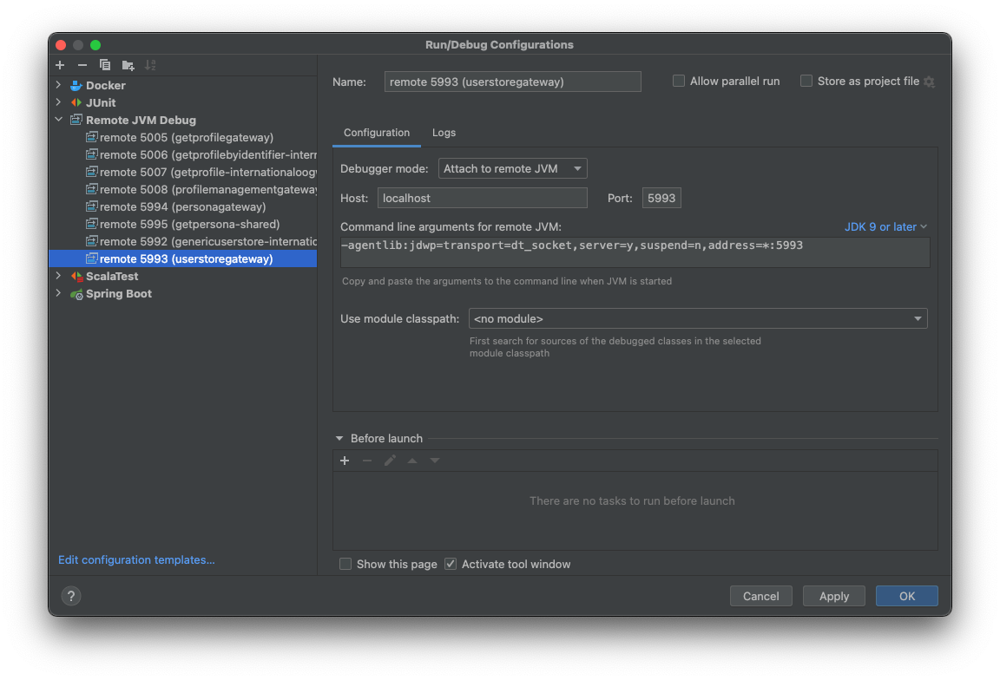

# Breakpoints

Add the debugger command and expose that port from the container.  E.g. port 5992 used in the following example:

```yml
    genericuserstore-internationaloogway:
      image: sky-identity-docker-local.jfrog.io/cybertron/userstore-genericuserstoreservice:latest
      restart: always
      environment:
        ...
      command: -agentlib:jdwp=transport=dt_socket,server=y,suspend=n,address=*:5992
      ports:
        - 5992:5992
```

Add as many debugging commands as you need and then add a Debug Configuration in IntelliJ to connect.

Putting the port number and the container name in the config name helps identify the correct debugger to attach to the correct container. Make sure the port is set correctly in the "Port" input field.



## Code hot-swap

Using this setup you can hot-swap simple code changes while the containers are running (e.g. add a line to a method, but changes to class structure cannot be hot-swapped).

# Components

## Userstore

### `com.sky.userstore.genericuserstoreservice.UserStoreRetrieveDocuments#retrieveDocuments`

Docker: `genericuserstore-internationaloogway`

```scala
    val accessLayerDocumentInfoList = requests.map { case RetrieveDocumentRequest(_, docInfo, _) => docInfo }
```

`accessLayerDocumentInfoList` has the document id infos, if you need to know which documents were loaded.

E.g.:

```scala
ArrayBuffer(DataAccessLayerDocumentInfo(PERSONA_ALL,ArrayBuffer(f9fd9879-3eea-49af-8d7c-ddea6761bd65))))
```

### `com.sky.userstore.genericuserstoreservice.GenericUserStoreService#getUserStoreDocuments`

Docker: `genericuserstore-internationaloogway`

This breakpoint is hit before `com.sky.userstore.genericuserstoreservice.UserStoreRetrieveDocuments#retrieveDocuments`.

### `com.sky.userstore.common.persistence.CouchbaseDataAccessLayer#get`

Docker: `genericuserstore-internationaloogway`

This breakpoint lets you see the final Couchbase key if you breakpoint the Document and SubDocument cases:

```scala
  final def get(documentInfo: DataAccessLayerDocumentInfo, provider: String, territory: String, proposition: Option[String]): Future[JValue] =
    keyPathMapper.matchToPath(documentInfo) match {
      case KeyTooLarge() =>
        Future.exception(InvalidDocumentKeyException("Document key too large"))
      case Document(key, bucketGroup, _) =>
🐞        repository.getDocument(key, provider, territory, bucketGroup)
          .map(_ \ "data")
      case SubDocument(key, path, bucketGroup, _) =>
🐞        repository.getSubDocument(key, path, provider, territory, bucketGroup)
    }
```

E.g. key would be `USER_STORE_PERSONA_f9fd9879-3eea-49af-8d7c-ddea6761bd65`.
