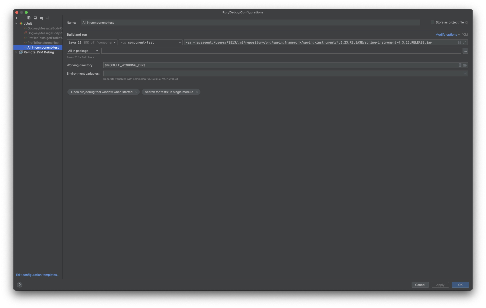

# oogway

Oogway stuff


# Tomcat

## Run in debug mode

Running in debug mode (so you can attach a remote debugger from IntelliJ)

Either set these vars in the terminal, and run the `catalina` script with the following params...

```
export JPDA_ADDRESS=8000
export JPDA_TRANSPORT=dt_socket
bin/catalina.sh jpda start
```

or edit `startup.sh` ...

## TOMCAT/bin/startup.sh

- set env vars in startup script
- Change the execute line at the end to include jpda start

```
export JPDA_ADDRESS=8000
export JPDA_TRANSPORT=dt_socket

...

exec "$PRGDIR"/"$EXECUTABLE" jpda start "$@"
```


# Running component tests

Set extra JVM args...

```
-ea -javaagent:/Users/PGE13/.m2/repository/org/springframework/spring-instrument/4.3.23.RELEASE/spring-instrument-4.3.23.RELEASE.jar
```



Command line:

`mvn clean test -Denvironment=fun -Pfunctional -U -V`

## Run single Cucumber feature file

Pass in path to feature as `-Dcucumber.options` option value:

```
-ea -javaagent:/Users/PGE13/.m2/repository/org/springframework/spring-instrument/4.3.23.RELEASE/spring-instrument-4.3.23.RELEASE.jar
-Dcucumber.options="src/test/resources/Management/Tokens/revoketokens.feature"
```

## Run tagged tests

Write a 'runner' class and specify the tags to run, `grimbo` in this case.

(`component-test/src/test/java/GrimboTest.java`)

```java
import cucumber.api.CucumberOptions;
import cucumber.api.junit.Cucumber;
import org.junit.runner.RunWith;

@RunWith(Cucumber.class)
@CucumberOptions(strict=true, format = {"pretty", "json:target/cucumber.json"}, monochrome = true, tags={"@grimbo"})
public class GrimboTest {
}
```

And tag the appropriate scenario(s):

```cucumber
@managementtokens
Feature: revoke all tokens

  METHOD: DELETE
  PATH: /management/tokens/id/<nsprofileid>

  @grimbo
  Scenario: CRM team should be able to revoke all tokens for a profile
    Given a user
    And an oauth token exists
```
